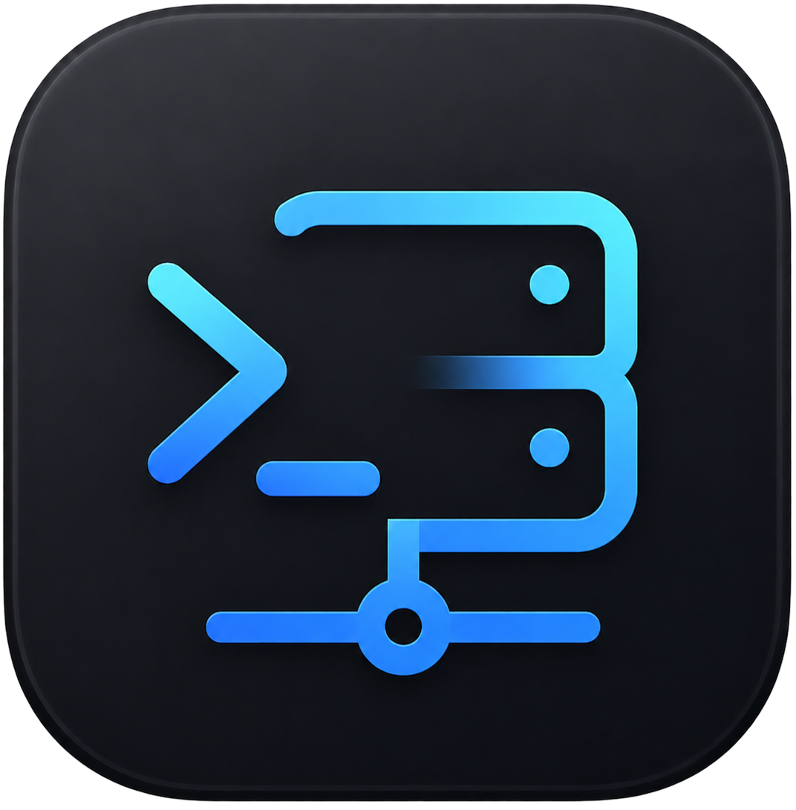

<div align="center">



# Perms

**โปรแกรมจัดการ SSH / terminal บนเดสก์ท็อป พร้อม AI agent ในตัว — ทำงาน offline, ข้อมูลอยู่ในเครื่องล้วน**

[](https://github.com/pepcompat/perms/actions/workflows/ci.yml)
[](https://github.com/pepcompat/perms-desktop/releases/latest)
[](https://github.com/pepcompat/perms-desktop/releases)
[](LICENSE)

[](https://github.com/pepcompat/perms/stargazers)

[⬇️ ดาวน์โหลด](https://github.com/pepcompat/perms-desktop/releases/latest) ·
[🐛 รายงานบั๊ก](https://github.com/pepcompat/perms/issues)

</div>

---

## Perms คืออะไร

Perms คือโปรแกรมจัดการ **SSH / terminal** บนเดสก์ท็อป ที่ฝัง **AI agent** ไว้ในตัว ช่วยดูแลและแก้ปัญหา
เซิร์ฟเวอร์ได้เร็วขึ้น โดย **ทุกอย่างทำงานในเครื่องคุณ** — รายละเอียด server, ความลับ, ประวัติคำสั่ง และ
บทสนทนากับ AI เก็บใน local database ทั้งหมด ไม่มี backend บน cloud

## คุณสมบัติเด่น

- 🔐 **จัดการ SSH ครบทุกแบบ** — password / private key (+passphrase) / ssh-agent / **jump host (bastion)** · จัดกลุ่ม + ลากจัดลำดับได้
- 🖥️ **Terminal** ทั้ง SSH และ local shell หลาย tab พร้อมกัน (xterm.js) · มี inline suggestion จากประวัติคำสั่ง
- 🤖 **AI agent 3 โหมด** — *แนะนำ* / *อนุมัติก่อนรัน* / *agentic (รันเองเป็น loop)* · รองรับ **OpenAI, Anthropic, Google**
- 📁 **SFTP + File editor** — เปิด / อัปโหลด / ดาวน์โหลด และ **แก้ไฟล์บนเซิร์ฟเวอร์** (เช่น `.env`) พร้อม syntax highlight, undo/redo, บันทึกด้วย `⌘S`
- 📚 **คลังความรู้** (AI จำสิ่งที่คุณสอน) + **Runbooks** (ชุดคำสั่งใช้ซ้ำ ใส่ตัวแปร `{{param}}` ได้) + ประวัติคำสั่ง
- ✨ **"ถาม AI ว่าทำไมพัง"** คลิกเดียว — ส่งคำสั่ง + ผลลัพธ์ล่าสุดให้ AI ช่วยหาสาเหตุและวิธีแก้

## ความปลอดภัย & ความเป็นส่วนตัว

- ความลับ (API key, SSH password/passphrase) เข้ารหัสด้วย **OS keychain** (Electron `safeStorage`) — ไม่เก็บ plaintext
- ข้อมูลทั้งหมดอยู่ใน **local SQLite** ในเครื่องคุณ ไม่ส่งออกที่ไหน
- ข้อความที่คุยกับ AI ส่งไปยัง **provider ที่คุณเลือก** ด้วย **API key ของคุณเอง** เท่านั้น และระบบจะ **กรองความลับ** (key/password/token) ออกจากข้อความก่อนส่ง
- โหมด agentic **ถามยืนยันก่อนรันคำสั่งอันตราย** (`rm -rf`, `mkfs`, `dd`, …)
- แก้ไฟล์แบบปลอดภัย: เขียนแบบ **atomic** (เน็ตหลุดไฟล์ไม่พัง) + คงสิทธิ์ไฟล์เดิม

## ดาวน์โหลด (ผู้ใช้ทั่วไป)

ไปที่ **[Releases](https://github.com/pepcompat/perms-desktop/releases/latest)** แล้วโหลดตาม OS:

| OS | ไฟล์ |
|----|------|
| macOS (Apple Silicon) | `.dmg` — เซ็น + notarize แล้ว |
| Windows | `.exe` (ตัวติดตั้ง NSIS) |
| Linux | `.AppImage` หรือ `.deb` |

แอปมี **auto-update** เมื่อมีเวอร์ชันใหม่

## Stack

electron-vite · React + TypeScript + Tailwind · xterm.js · node-pty · ssh2 · better-sqlite3 · CodeMirror 6 · OpenAI / Anthropic / Google SDK

## Build จาก source

ต้องมี **Node.js 20+** และ **pnpm**

```bash
pnpm install          # ติดตั้ง + rebuild native module (better-sqlite3, node-pty) ให้ Electron
pnpm dev              # รันโหมด dev (hot reload)
pnpm build            # build ตัวติดตั้งของ OS ปัจจุบัน
pnpm typecheck        # ตรวจ type
pnpm test             # รันเทสต์ (vitest)
```

<details>
<summary>เจอ error <code>No module named 'distutils'</code> ตอน install?</summary>

`better-sqlite3` และ `node-pty` build ด้วย `node-gyp` ที่ต้องใช้ `distutils` แต่ Python 3.12+
เอาออกจาก stdlib แล้ว — สร้าง venv ที่มี `setuptools` แล้วชี้ node-gyp ไปใช้:

```bash
python3 -m venv .gypvenv
.gypvenv/bin/pip install setuptools
npm_config_python="$PWD/.gypvenv/bin/python" pnpm install
```
</details>

## โครงสร้างโปรเจกต์

```
src/
  main/       # Electron main: terminal (pty/ssh), sftp, ai agent, db, ipc, secrets
  preload/    # bridge window.api (contextIsolation)
  renderer/   # React UI (components, stores, lib)
  shared/     # type + ipc channels ที่ใช้ร่วม main↔renderer
```

DB tables: `servers`, `secrets`, `sessions`, `commands`, `ai_history`, `runbooks`, `knowledge`, `settings`
(เก็บที่ `app.getPath('userData')/perms.db`)

## ร่วมพัฒนา

ยินดีรับ **issue / PR** — เปิด issue เล่าปัญหาหรือไอเดียก่อนได้เลย
ก่อนส่ง PR รบกวนรัน `pnpm typecheck && pnpm test` ให้ผ่าน (CI จะเช็คให้ทุก PR ด้วย)

## License

เผยแพร่ภายใต้สัญญาอนุญาต **[MIT](LICENSE)** © pepcompat

ใช้ open-source dependencies แบบ permissive (MIT / BSD / Apache-2.0 / ISC / OFL) — ดูรายการ license
ทั้งหมดใน **[THIRD-PARTY-LICENSES.md](THIRD-PARTY-LICENSES.md)** (สร้างใหม่ได้ด้วย `pnpm licenses`)
